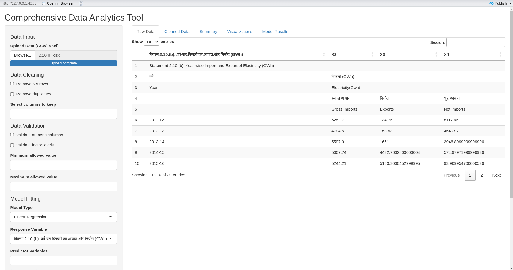

# 📊 VIZORD - SOLUTION FOR DATA 

[](https://www.r-project.org/)  
[](https://shiny.posit.co/)  
[](LICENSE)  
[](../../pulls)  
[](https://github.com/threed2y/OFA---DA-/stargazers)  

An **all-in-one interactive data analytics web app** built with **R** and **Shiny**.  
From **data upload** → **cleaning** → **visualization** → **modeling** → **exporting**,  
this tool transforms raw datasets into actionable insights — **no coding required**.  

---

## 🖼 **Preview Screenshot**  

  

---

## ✨ **Key Features**  

### 📂 Flexible Data Input  
- Upload datasets in **CSV** or **Excel** formats.  
- Instant data preview after upload.  

### 🧹 Data Cleaning & Preprocessing  
- Remove **missing values** with one click.  
- Remove **duplicate rows** instantly.  
- Select and subset columns for focused analysis.  

### ✅ Data Validation  
- Apply **min/max thresholds** for numeric columns.  
- Flag and fix invalid entries automatically.  

### 📊 Dynamic Visualizations  
- **Histograms** & **Box Plots** for distributions.  
- **Scatter Plots** for relationships.  
- **Bar Plots** for categorical comparisons.  
- Download any plot as a **PNG**.  

### 🤖 Machine Learning Models  
- Fit **Linear Regression**, **Logistic Regression**, **Random Forest**, and **Decision Tree**.  
- Dynamically select predictors and response variables.  
- View **model summaries**, coefficient tables, and diagnostic plots.  

### 💾 Export & Save  
- Download cleaned datasets as **CSV**, **Excel**, or **RData**.  
- Export **full Excel reports** including raw data, cleaned data, and model results.  

---

## 🚀 **Getting Started**  

### **Prerequisites**  
- **R**: Version 4.0+  
- **RStudio** (recommended)  

### **Installation**  

```bash
# Clone the repository
git clone https://github.com/threed2y/OFA---DA-.git
cd OFA---DA-
```

Open R/RStudio and install dependencies:  

```r
install.packages(c("shiny", "shinyjs", "DT", "ggplot2", "dplyr", "caret", "readr", "openxlsx"))
```

---

## 💻 **Usage**  

1. Open `app.R` in RStudio.  
2. Click **Run App**.  
3. Use the sidebar to:  
   - **Upload** data  
   - **Clean & validate**  
   - **Visualize** results  
   - **Fit models**  
   - **Export outputs**  

---

## 🤝 **Contributing**  

We welcome contributions!  

1. Fork the project  
2. Create your feature branch:  
   ```bash
   git checkout -b feature/AmazingFeature
   ```  
3. Commit changes:  
   ```bash
   git commit -m "Add AmazingFeature"
   ```  
4. Push to your branch:  
   ```bash
   git push origin feature/AmazingFeature
   ```  
5. Open a Pull Request  

---

## 📜 **License**  
Licensed under the [MIT License](LICENSE).  
